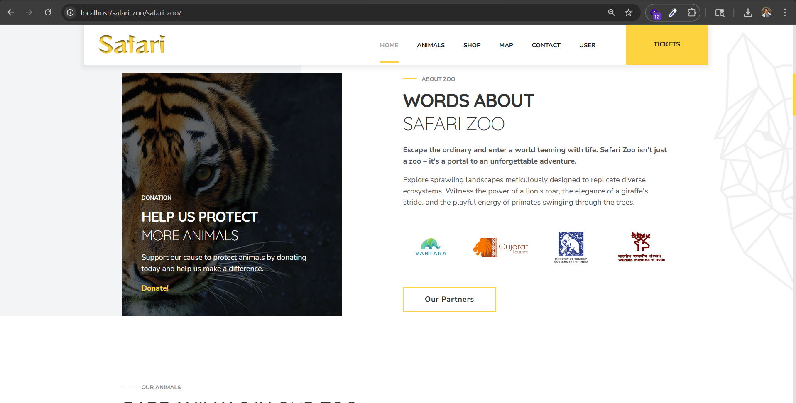

<<<<<<< HEAD
# SAFARI - Zoo Management System


SAFARI is a comprehensive zoo management system designed to streamline operations and enhance visitor experience. It offers features for managing visitors, animals, staff, and various aspects of zoo management.

## Features

- **Visitor Management:** Track visitor information, ticket sales, and attendance.
- **Animal Management:** Manage animal details, health records, and habitats.
- **Staff Management:** Maintain staff records, schedules, and tasks.
- **Inventory Management:** Keep track of zoo supplies, food, and equipment.
- **Event Management:** Organize events, shows, and educational programs.
- **Reporting:** Generate reports on various aspects of zoo operations.

## Technologies Used

- **Frontend:** HTML, CSS, JavaScript
- **Backend:** PHP
- **Database:** MySQL
- **Others:** Git, GitHub

## Installation

1. Clone the repository:

    ```
    git clone https://github.com/yourusername/safari.git
    ```

2. Navigate to the project directory:

    ```
    cd safari
    ```

3. Import the SQL database:

    Create a MySQL database named 'safari' and import the provided SQL file.

4. Start the PHP server:

    ```
    php -S localhost:8000
    ```

5. Access SAFARI in your browser at `http://localhost:8000`.
=======
# safari-zoo
A full-featured Safari Zoo web application built with PHP, MySQL, and JavaScript. Features include online ticket booking with Razorpay payment gateway, animal donation system, automated email confirmations via PHPMailer, user authentication, zoo map, events management, animal gallery, shop, feedback system, and admin panel.

# 🦁 Safari Zoo Website

A complete zoo management and booking web application.

## Features
- 🎫 Online Ticket Booking (Child/Adult/Senior)
- 💳 Razorpay Payment Gateway Integration
- 📧 Automated Email Confirmations (PHPMailer)
- 💚 Animal Donation System
- 🐘 Animal Gallery
- 🗺️ Zoo Map
- 🛍️ Online Shop
- 📅 Events Management
- 👤 User Authentication
- 🔧 Admin Panel
- 📝 Feedback System

## Tech Stack
- **Frontend:** HTML, CSS, JavaScript, jQuery
- **Backend:** PHP
- **Database:** MySQL (phpMyAdmin)
- **Payment:** Razorpay
- **Email:** PHPMailer (Gmail SMTP)
- **Server:** XAMPP (Apache)

## Installation

### Requirements
- XAMPP (PHP 7.4+)
- MySQL
- Internet connection (for Razorpay & Gmail SMTP)

### Steps
1. Clone the repository
   git clone https://github.com/yourusername/safari-zoo-website.git

2. Copy to XAMPP htdocs folder
   C:/xampp/htdocs/safari-zoo/

3. Import Database
   - Open phpMyAdmin
   - Create database named safari
   - Import safari.sql file

4. Configure Database
   - Open Db/dbConnection.php
   - Update your credentials

5. Configure Email
   - Open tickets.php and donation-mail.php
   - Update Gmail credentials

6. Configure Razorpay
   - Open tickets.php and payment.php
   - Update your Razorpay API key

7. Start XAMPP
   - Start Apache and MySQL
   - Open localhost/safari-zoo/safari-zoo/

## Database Setup
Import the included safari.sql file in phpMyAdmin

## Screenshots





## License
MIT License
>>>>>>> facd617199f331786e6e17a31a57f2d26f089b31
